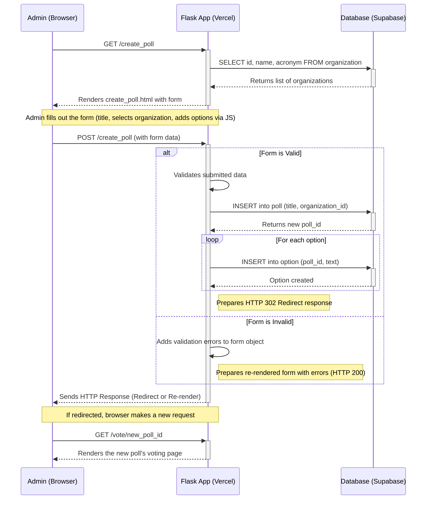

```mermaid
sequenceDiagram
    participant Admin as Admin (Browser)
    participant Flask as Flask App (Vercel)
    participant DB as Database (Supabase)

    Admin->>+Flask: GET /create_poll
    Flask->>+DB: SELECT id, name, acronym FROM organization
    DB-->>-Flask: Returns list of organizations
    Flask-->>-Admin: Renders create_poll.html with form

    Note over Admin, Flask: Admin fills out the form (title, selects organization, adds options via JS)

    Admin->>+Flask: POST /create_poll (with form data)
    
    alt Form is Valid
        Flask->>Flask: Validates submitted data
        Flask->>+DB: INSERT into poll (title, organization_id)
        DB-->>-Flask: Returns new poll_id
        
        loop For each option
            Flask->>+DB: INSERT into option (poll_id, text)
            DB-->>-Flask: Option created
        end
        
        Note right of Flask: Prepares HTTP 302 Redirect response
    else Form is Invalid
        Flask->>Flask: Adds validation errors to form object
        Note right of Flask: Prepares re-rendered form with errors (HTTP 200)
    end

    Flask-->>-Admin: Sends HTTP Response (Redirect or Re-render)

    Note over Admin, Flask: If redirected, browser makes a new request
    
    Admin->>+Flask: GET /vote/new_poll_id
    Flask-->>-Admin: Renders the new poll's voting page
```