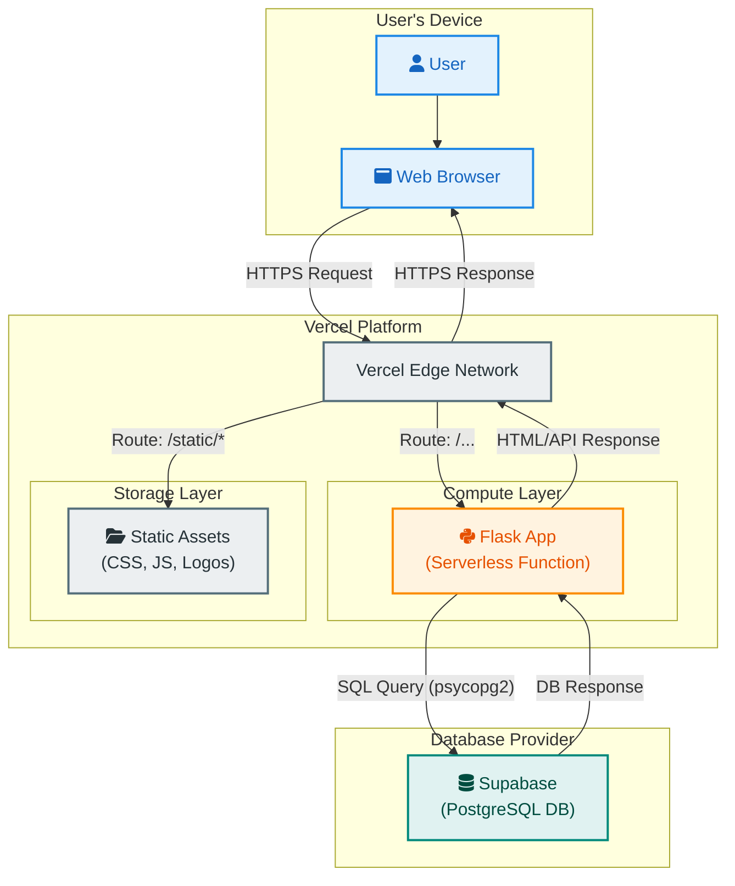

<!-- *Note: For the icons (`<i class='fa fa-user'></i>`) to render correctly in VS Code's preview, you may need to have an extension that supports Font Awesome icons within Mermaid diagrams. The diagram will still work and be perfectly readable without the icons.* -->
